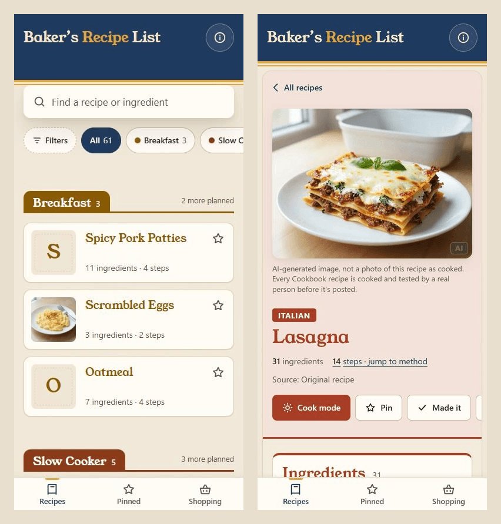

# Baker's Recipe List

A fast, single-page React app for browsing a personal recipe collection with
automatic per-recipe macro/nutrition estimates.



_The Cookbook list and a recipe page (Lasagna), at phone size._

**Live:** https://buildwithbaker.github.io/bakers-recipe-list/

## Features

- **The Cookbook**, narrowed by colour-coded **category chips** and a
  **Filters** sheet (pinned, made, tags).
- **One search**: names, ingredients and tags, plus **auto-tagging** with a
  tag browser.
- **Recipe card and full page** themed to the recipe's category: tickable
  ingredients, a numbered method, **cook mode** (keeps the screen awake), a
  **serving scaler**, pin / made, share and print.
- **Photos:** drop `src/photos/<id>.jpg` and the build makes the card, page and
  link-preview sizes (see `docs/internal/adding-a-photo.md`).
- **Macro & nutrition estimates** per recipe via USDA FoodData Central lookups
  (with per-ingredient overrides and a graceful `DEMO_KEY` fallback).
- **Ingredient parsing**, **unit-to-grams conversion**, and serving/macro estimation.
- **Shopping list** and **cook log / history** with notes.
- **Pinned recipes** (their own tab), **recently viewed** and print support;
  pins and history persist in `localStorage`.
- **Navigation:** Recipes / Pinned / Shopping as a bottom tab bar on a phone
  (in the header on wider screens), a sticky compact header, and an About page
  at `/about/`.

## Tech stack

- [Vite](https://vitejs.dev/) 8 + [React](https://react.dev/) 19
- CSS Modules for component styling
- Deployed as a static site to GitHub Pages

## Local setup

Requires Node 22 (see `.nvmrc`).

```bash
git clone https://github.com/buildwithbaker/bakers-recipe-list.git
cd bakers-recipe-list
npm install
npm run dev        # Vite dev server at http://localhost:5173
npm run build      # production build to dist/
```

Nutrition lookups work without configuration (they fall back to `DEMO_KEY`). To
avoid rate limits, set `VITE_USDA_API_KEY` in a local `.env` (gitignored) or as
the `USDA_API_KEY` repo secret used by the deploy workflow.

## Project structure

```
index.html              app entry
vite.config.js          Vite config (base: /bakers-recipe-list/)
src/
  main.jsx              React bootstrap
  App.jsx               top-level app
  components/           UI components (CSS Modules) — Masthead, SearchBar,
                       RecipeList, RecipeCard, SearchResults,
                       FiltersSheet, Shelves, RecipeView/Modal/Page, MacroCard,
                       ShoppingList, TabBar, PinnedList, AboutPage,
                       ErrorBoundary, UsdaKeyNotice
  hooks/               useShoppingList, useCookLog/useCookHistory,
                       usePinnedRecipes, useRecentlyViewed, useMacroEstimate,
                       useFocusTrap
  context/             CookHistoryContext
  data/                recipes.json, recipeIndex, sections, catalog, nutritionOverrides
  utils/               ingredient parsing, gram conversion, macro/serving estimates,
                       USDA fetch, autoTags, fractions, scaleIngredient
  styles/tokens.css    design tokens (light only)
  styles/globals.css   base and print styles
.github/workflows/      ci.yml (build check), deploy.yml (Pages)
```

## Deployment

Pushes to `main` auto-deploy to GitHub Pages via
[`.github/workflows/deploy.yml`](.github/workflows/deploy.yml) (builds `dist/`
and publishes it). The Vite `base` is set to `/bakers-recipe-list/` to match the
Pages project path.

> **Internals:** see [docs/internal/architecture.md](docs/internal/architecture.md) for the full architecture reference — data model, the USDA nutrition pipeline, components/hooks/utils map, extension points, and gotchas.

## License

[MIT](LICENSE). The MIT license covers the **code**; the recipe content is the
author's own.
